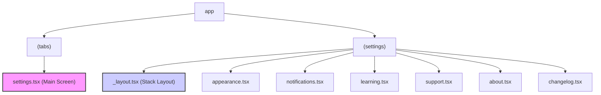

### Technical Plan: Settings Section Implementation

This document outlines the technical plan for creating a new, structured settings section for the application. The plan focuses on establishing the foundational structure, including file organization, component design, and navigation, as a first step before implementing the logic for individual settings.

---

### 1. File Structure

To create a clean and scalable structure for the settings screens, we will use a grouped route in `expo-router`. This will keep all settings-related screens organized in a single directory and allow for a shared layout.

**Main Settings Screen:**

- The primary settings screen will remain at `app/(tabs)/settings.tsx`. This file will be modified to display the new categorized list of settings.

**Settings Sub-screens:**
A new grouped route directory will be created at `app/(settings)/`. This approach uses a layout route to provide a consistent UI shell (like a header with a back button) for all sub-screens, without adding `(settings)` to the URL path.

The following new files will be created:

- `app/(settings)/_layout.tsx`: This file will define the common layout for all settings sub-screens, including a stack navigator to manage the navigation hierarchy and provide a back button.
- `app/(settings)/appearance.tsx`: For **Appearance** settings.
- `app/(settings)/notifications.tsx`: For **Notifications** settings.
- `app/(settings)/learning.tsx`: For **Learning Settings**.
- `app/(settings)/support.tsx`: For **Support & Feedback** options.
- `app/(settings)/about.tsx`: For the **About** page.

The existing `app/changelog.tsx` will be moved to:

- `app/(settings)/changelog.tsx`: To consolidate all settings-related screens. A redirect might be needed if the old route was public.

**File Structure Diagram:**



---

### 2. Component & Layout Design

The main settings screen, `app/(tabs)/settings.tsx`, will be redesigned to present the settings in clear, logical sections as requested.

- **Component Choice:** We will use a `SectionList` from React Native. It is the most appropriate component for rendering grouped or sectioned data, providing better performance and semantics than a `ScrollView` with manually rendered sections.

- **Data Structure:** The data for the `SectionList` will be structured as an array of section objects, where each object contains a `title` and a `data` array of list items.

  ```typescript
  const sections = [
    {
      title: "Content & Learning",
      data: [
        { title: "Appearance", icon: "🖌️", href: "/appearance" },
        { title: "Notifications", icon: "🔔", href: "/notifications" },
        { title: "Learning Settings", icon: "⚙️", href: "/learning" },
      ],
    },
    {
      title: "Support & Info",
      data: [
        { title: "Support & Feedback", icon: "❤️", href: "/support" },
        { title: "Rate This App", icon: "⭐", action: "rate" },
        { title: "About", icon: "ℹ️", href: "/about" },
        { title: "Changelog", icon: "🔄", href: "/changelog" },
      ],
    },
  ];
  ```

- **List Item Component:** Each item in the list will be a custom component that includes:
  - An icon (emoji or `FontAwesome` icon).
  - The setting title (`Text`).
  - A chevron icon on the right to indicate it's a navigation item.
  - The entire item will be wrapped in a `Pressable` component.

---

### 3. Navigation

Navigation from the main settings screen to the sub-screens will be handled using `expo-router`.

- **`<Link>` Component:** Each navigation item in the `SectionList` will use the `<Link>` component from `expo-router` to navigate to its respective screen.

  ```tsx
  import { Link } from "expo-router";

  // Inside the SectionList's renderItem function
  <Link href={item.href} asChild>
    <Pressable>{/* Icon, Text, Chevron */}</Pressable>
  </Link>;
  ```

- **Stack Navigator:** The `app/(settings)/_layout.tsx` file will configure a `Stack` navigator. This will automatically provide a header with a title for each sub-screen and a back button to return to the main settings screen.

  ```tsx
  // app/(settings)/_layout.tsx
  import { Stack } from "expo-router";

  export default function SettingsLayout() {
    return (
      <Stack>
        <Stack.Screen name="appearance" options={{ title: "Appearance" }} />
        <Stack.Screen
          name="notifications"
          options={{ title: "Notifications" }}
        />
        {/* ... other screens */}
      </Stack>
    );
  }
  ```

---

### 4. Initial Implementation Scope

The first phase of implementation will focus exclusively on building the static structure and navigation, without implementing the logic for any individual setting.

**The goals for the initial task are:**

1.  **Refactor `app/(tabs)/settings.tsx`:**

    - Replace the current layout with a `SectionList`.
    - Populate the `SectionList` with the new, categorized settings data.
    - Style the list and items to match the app's design.

2.  **Create New Files and Directories:**

    - Create the `app/(settings)` directory.
    - Create the `_layout.tsx` file with the `Stack` navigator configuration.
    - Create placeholder files for `appearance.tsx`, `notifications.tsx`, `learning.tsx`, `support.tsx`, and `about.tsx`. Each file will contain a simple component that renders its title.

3.  **Move Existing Files:**

    - Move `app/changelog.tsx` to `app/(settings)/changelog.tsx`.

4.  **Footer:**
    - Add a footer to the `SectionList` in `app/(tabs)/settings.tsx` to display the app version.
